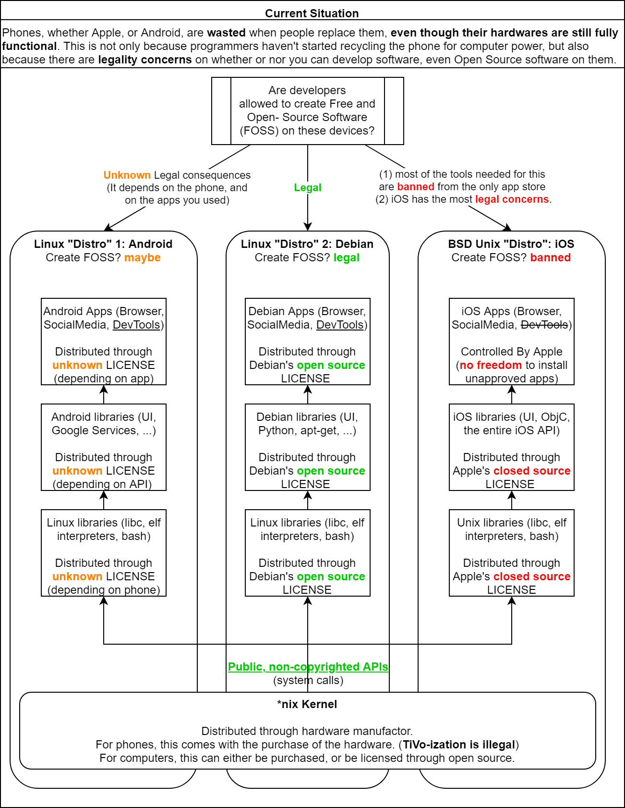
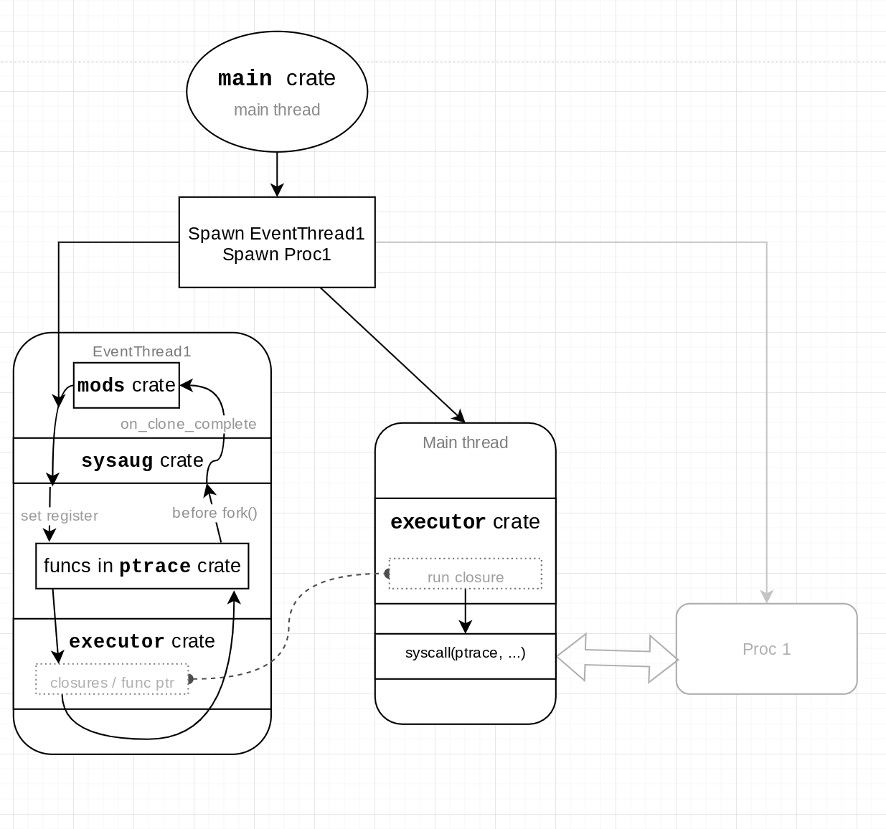

## Why?

I developed this project to solve the problem that FOSS developers cannot easily install an Open Source Linux Distro onto their phones if they want to develop software, or teach software development, on the go.

Here is a diagram explaining why the problem exists:



My solution is not that different from proot. In fact, it's inspiried by proot -- we can intercept system calls through ptrace() and simulate the chroot() system call so that we can chroot into a different Linux Distro on a non-rooted phone. However, there are a few differences:

1. This solution is multithreaded, while proot itself is single threaded.
2. This solution is designed to run Linux Distros on phones, while proot itself needs patches to run on phones.

## Project structure



Both sysaug and mods crates are supposed to modify the behavior of system calls. But here are the differences:

Sysaug is a backend while mods are the frontend.
- `sysaug` is a backend, low level ability to modify specific syscalls (i.e. remapping path of openat())
- `mods` are the fronted, high level features (provides chroot / root, without having root)

Mods are dynamic but sysaug isn't.
- `mods` can be imported, enabled, and disabled dynamically. Disabling mods should improve efficiency.
- `sysaug` is not dynamic and cannot be turned on/off or imported without rebuilding the binary, but frontend mods should eventually be able to.

## For Developers

How to debug problems:

- `RUST_LOG=TRACE RUST_BACKTRACE=1 cargo run  -- --chroot xxx --root |& ansi2txt | tee ~/logfile | grep -v TRACE | grep -v DEBUG`

Overhead: Tested on Android Termux:

proot slows down `git status` to about 5x its original run time.

- original total wall time: about 10ms
- proot total wall time: about 50ms

As long as our parallel proot doesn't slow down the tracee by more than 5x. It should be fine.


How to cross-compile for Android:

- Install `arm-linux-*-gcc` and `aarch64-linux-*-gcc`
  - Depending on the license of these softwares, the `*` portion might differ
  - We prefer [Musl libc toolchains](https://musl.cc/).
- Update your `~/.cargo/config`:
  ```
  [target.armv7-unknown-linux-musleabihf]
  rustflags = ["-C", "target-feature=+crt-static"]
  linker = "arm-linux-foobar-gcc"

  [target.armv7-unknown-linux-musl]
  rustflags = ["-C", "target-feature=+crt-static"]
  linker = "aarch64-linux-foobar-gcc"
  ```
- Run `cargo build --target=armv7-unknown-linux-musleabihf --release`
- Or run `cargo build --target=aarch64-unknown-linux-musl --release`
- **Android permissions**
  - The terminal emulator must request specific permissions to unlock the ability to execute `./dockify`. The exact permission name is unknown.
  - Older Android versions work better with https://f-droid.org/en/packages/org.galexander.sshd/
  - [Android 10 and above require executables to be codesigned](https://github.com/greenaddress/abcore/issues/97)
    - Termux is the only solution that works well in this situation. [Here is a page from their discussion.](https://github.com/termux/termux-app/issues/1072)
    - But apparently, IT'S EASIER IF `dockify` IS CODE SIGNED AS part of the readonly APK.